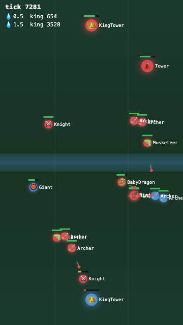

# AI Agent Battle Simulator

> Write a bot, drop it into a Clash-style arena, and watch it fight another bot — then replay the battle in your browser.

<p align="center">
  
</p>

Built for the ACM club so members can write competing AI agents and run them against each other. It has three parts you'll actually touch:

- **The arena** — a Python battle engine simulates a Clash Royale–style 1v1 match, tick by tick.
- **The orchestrator** — runs two agents as separate programs, feeds each one the game state, applies their moves, and records the match to a replay file.
- **The viewer** — a small web app that plays back any match (or watches one live) and runs single-elimination tournaments.

Your agent can be written in **any language** — it just reads JSON from standard input and writes JSON back out. See [Write an agent](#write-an-agent).

## Quickstart

**1. Install** (tested on Python 3.11):

```bash
python3 -m venv .venv
source .venv/bin/activate
pip install -r requirements.txt
```

**2. Run a match** between two copies of the reference agent:

```bash
.venv/bin/python -m orchestrator.cli \
  --agent-a ".venv/bin/python agents/baseline_random/agent.py" \
  --agent-b ".venv/bin/python agents/baseline_random/agent.py" \
  --seed 123 \
  --log-path logs/example_match.jsonl
```

It prints the result and writes a replay (one JSON snapshot per tick):

```json
{ "winner": 0, "forfeited_by": null, "ticks": 4580, "completed": true, "seed": 123 }
```

**3. Watch it.** Start the viewer and open the replay:

```bash
uvicorn web.server:app --reload
```

Then open <http://localhost:8000/> and click the match, or go straight to
`http://localhost:8000/viewer?log=logs/example_match.jsonl&mode=replay`.

> **On `--seed`:** it makes the *engine* deterministic. The reference agent uses its own unseeded randomness in a separate process, so replaying the same seed with a random agent won't reproduce the exact same match.

## Write an agent

An agent is any program the orchestrator can launch that speaks JSON over stdin/stdout. On each turn (agents are polled every 5 ticks) it receives one line of game state and must reply with one line describing its move.

**Startup:** your program is launched with the player id (`0` or `1`) as its final command-line argument.

**Each turn, you receive** one JSON object like this (the opponent's hand and next card are hidden — fog of war):

```json
{
  "request_id": 42,
  "tick": 30,
  "elixir": 2.4,
  "hand": ["Musketeer", "Archer", "Giant", "Minions"],
  "next_card": "BabyDragon",
  "own_troops": [{ "card": "Knight", "x": 9.0, "y": 10.0, "hp": 1789 }],
  "enemy_troops": [],
  "towers": {
    "own":   { "king": 4824, "left": 3631, "right": 3631 },
    "enemy": { "king": 4824, "left": 3631, "right": 3631 }
  }
}
```

**You reply** with one of two actions. Echo back the `request_id` you were given:

```json
{ "request_id": 42, "action": "deploy", "card": "Musketeer", "x": 9.0, "y": 6.0 }
```
```json
{ "request_id": 42, "action": "none" }
```

Deploy a card by its **name** (it must be in your `hand`), at an `(x, y)` tile on your side of the arena. Illegal moves — a card you can't afford, a bad position — are silently ignored by the engine, so you don't have to validate them yourself.

**Rules of the road:**

- You have **100 ms** to respond each turn. Miss 5 turns in a row and you forfeit. (There's a 2-second grace period at startup.)
- Read the reference agent — [`agents/baseline_random/agent.py`](agents/baseline_random/agent.py) — for a complete, working example in under 60 lines.
- Run yours the same way as the Quickstart, swapping in your command:

```bash
.venv/bin/python -m orchestrator.cli \
  --agent-a ".venv/bin/python agents/my_agent/agent.py" \
  --agent-b ".venv/bin/python agents/baseline_random/agent.py" \
  --seed 1 --log-path logs/my_match.jsonl
```

## Run a tournament

`run_bracket` plays a single-elimination bracket and writes the results. Save this as `run_bracket_example.py` in the repo root:

```python
from pathlib import Path
from tournament.bracket import run_bracket

if __name__ == "__main__":
    agents = [
        {"name": f"agent{i}", "command": [".venv/bin/python", "agents/baseline_random/agent.py"]}
        for i in range(4)
    ]
    results = run_bracket(
        agents,
        seed=123,
        logs_dir=Path("logs"),
        results_path=Path("tournament/results.json"),
    )
    print(results)
```

Run it from the repo root:

```bash
.venv/bin/python run_bracket_example.py
```

> Use a saved `.py` file — not a heredoc, `python -c`, or piped snippet. Matches within a round run in separate worker processes, and Python's multiprocessing needs a real file on disk to hand to those workers.

**Matches within a round run concurrently by default**, capped at your machine's CPU count. No flag to enable — pass `max_workers=N` to `run_bracket()` to lower the cap.

To *see* the concurrency: run a bracket with 8+ agents (expand `range(4)`), start the viewer, and open several round-1 logs in `mode=live` tabs at once:

```text
http://localhost:8000/viewer?log=logs/round1_match1.jsonl&mode=live
http://localhost:8000/viewer?log=logs/round1_match2.jsonl&mode=live
```

## The match viewer

Start it with `uvicorn web.server:app --reload` and open <http://localhost:8000/>. The home page lists every replay in `logs/` and every bracket in `tournament/` as clickable cards.

- **Replay mode** (`&mode=replay`) — scrub, play/pause, and step through a finished match. Playback runs from **1x up to 32x**, and the winner is shown the moment the replay loads, with a **Skip to End** button.
- **Live mode** (`&mode=live`) — watch a match animate while it's still being written to its log.
- Units render as team-colored circles with health bars; **projectiles** (arrows, fireballs, bombs) show as small streaks flying toward their targets.

## How it works

One match, from the orchestrator's point of view, each tick:

```
engine state ──▶ project (fog of war) ──▶ agent A ─┐
             └─▶ project (fog of war) ──▶ agent B ─┤
                                                   ▼
                        apply moves ──▶ advance engine ──▶ append replay snapshot
```

- The **engine** (`engine/`) is a vendored, pure-Python Clash-style simulator. It owns the full game state.
- The **orchestrator** (`orchestrator/`) drives the loop: it projects a fog-of-war view for each agent (each side sees the board but not the opponent's hand), sends it over stdin, reads the reply, applies legal moves, and writes a replay snapshot.
- The **replay** is JSONL — one self-contained JSON snapshot per line — which is what both the live and replay viewers read.

## Project layout

```
engine/         Vendored pure-Python battle engine (the "clasher" package) + game data
orchestrator/   Runs one match: agent subprocesses, fog-of-war projection, replay logging, CLI
tournament/     Single-elimination bracket runner (concurrent matches)
web/            FastAPI server + static HTML/CSS/JS match viewer
agents/         Example agents (start with baseline_random/)
tests/          Test suite for the orchestrator, tournament, and web layers
docs/           HANDOFF.md and design docs
```

## Development

Run the tests from the repo root:

```bash
.venv/bin/python -m pytest
```

The web UI is plain HTML/CSS/JS served directly by FastAPI — no build step, with one exception. If you change Tailwind utility classes in `web/static/*.html`, regenerate `web/static/theme.css`:

```bash
curl -sLo /tmp/tailwindcss https://github.com/tailwindlabs/tailwindcss/releases/latest/download/tailwindcss-macos-arm64
chmod +x /tmp/tailwindcss
/tmp/tailwindcss -i web/tailwind-input.css -o web/static/theme.css --minify
```

Swap `tailwindcss-macos-arm64` for your platform's binary (`tailwindcss-linux-x64`, `tailwindcss-windows-x64.exe`, …) from the [releases page](https://github.com/tailwindlabs/tailwindcss/releases/latest).

## Security note

Agents run as **unsandboxed subprocesses** — the orchestrator executes whatever command you give it, with no isolation or resource limits. A Docker sandbox is sketched at `docker/agent.Dockerfile` but isn't wired in yet. Until it is, only run agents you trust, on a trusted network. See [`docs/HANDOFF.md`](docs/HANDOFF.md) for the current state and open work.
