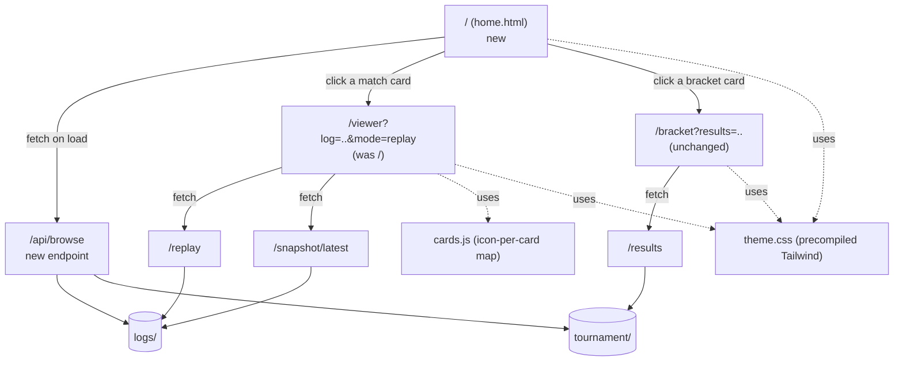

# Web UI Redesign

Status: approved for implementation
Date: 2026-07-05
Owner: Caden (solo build)

## Intent

Turn the functional-but-bare web pages into something that looks and feels like a real product — with a discoverable home page fixing the "you need to already know the URL" gap that caused a real viewer bug the day this was written (visiting the bare `/` URL, exactly as the README instructed, produced a silently blank canvas with no error).

## Overview

The web viewer currently ships three disconnected surfaces: a canvas replay page reachable only if you already know its exact `?log=&mode=` query string, a plain HTML-table bracket page, and no home page at all. This redesign adds a real front door, reworks the visual language around the Clash-Royale-style subject matter (arena palette, per-card icons), and does it all with precompiled Tailwind CSS so the site works fully offline at demo time — no CDN dependency, no Node/npm build pipeline for the handoff team to maintain.

This is a visual/UX polish pass on top of the completed Week 1 MVP (`docs/specs/2026-07-04-battle-sim-week1-mvp-design.md`), not a functional rework of the match/bracket engine underneath it.

## Architecture

## Decisions made during brainstorming

- **Scope:** add a real home page, not just reskin the two existing pages — the missing "front door" is what caused today's bug, not just an aesthetic gap.
- **Style direction:** game-inspired (arena palette, card-game texture) over a neutral dashboard look or ACM branding.
- **Tech approach:** Tailwind CSS, precompiled once via the standalone CLI (no Node/npm, no CDN at runtime) rather than a CDN `<script>` tag or a full JS framework + build step.
- **Canvas depth:** per-card-type icons (emoji) drawn over the existing team-colored circles, not just nicer dots and not full sprite art.
- **Home page refresh:** manual "Refresh" button, not auto-polling — this page is opened occasionally, not watched live.
- **Routing:** `/` is fully repurposed as the home page; the existing viewer moves to `/viewer` with no redirect kept at the old location. This is a deliberate one-time breaking change, made before the project has any real external users, specifically to close the discoverability gap for good rather than leaving `/` ambiguous.

## Components

### 1. `web/static/theme.css` — shared visual system

Generated once via the standalone Tailwind CLI (downloaded binary, no Node/npm), scanning the three HTML files for class usage, committed as a static, purged CSS file. Defines the game-inspired palette (deep arena green, gold accent, team blue `#4a90d9` / red `#d94a4a` carried over unchanged from the existing canvas colors) as CSS custom properties on `:root` so home/viewer/bracket share one source of truth. No CDN dependency at page-load time — this is what keeps the site usable without internet access during a live demo.

### 2. `web/static/cards.js` — shared card-icon module

A `CARD_ICONS` map from card name to emoji icon, covering the 10 names that can appear in a default-deck match — confirmed directly against the engine's default deck in `engine/src/clasher/player.py`. Exact mapping (pinned here so an implementer doesn't have to guess, and any future fix pass stays consistent):

| Card | Icon | Card | Icon |
|---|---|---|---|
| Knight | ⚔️ | BabyDragon | 🐉 |
| Archer | 🏹 | Balloon | 🎈 |
| Giant | 👹 | Wizard | 🧙 |
| Minions | 🦇 | Tower | 🗼 |
| Musketeer | 🔫 | KingTower | 👑 |

Exposes `getCardIcon(name)`, which falls back to `❔` for anything not in the map — so a future deck change degrades gracefully instead of breaking the renderer. Imported by `viewer.js`.

### 3. `GET /api/browse` — new backend endpoint

Added to `web/server.py`. Scans the existing `ALLOWED_ROOTS` directories (`logs/`, `tournament/` — the same allowlist already enforced for `/replay`, `/snapshot/latest`, and `/results`) and returns JSON listing recent `.jsonl` files under `logs/` (path, mtime, size) sorted newest-first, plus whether `tournament/results.json` exists. This is the only new server-side surface in this redesign; everything else is static-asset and template work. Gets a real pytest test in `tests/test_web_server.py` using `tmp_path` + monkeypatched `ALLOWED_ROOTS`, matching the pattern already established for every other endpoint — this is real backend logic, not a visual-only change, and the whole-branch review already set the precedent that backend logic here gets test coverage.

### 4. `web/static/index.html` — new home page (replaces the old viewer at `/`)

Fetches `/api/browse` on load and renders each match log and the bracket (if present) as a clickable card in a responsive grid. Match cards link to `/viewer?log=<path>&mode=replay`; the bracket card (shown only if `tournament/results.json` exists) links to `/bracket?results=tournament/results.json`. A manual "Refresh" button re-fetches `/api/browse`. When both lists are empty, shows a friendly empty state pointing at the CLI usage from the README instead of a blank page.

### 5. `web/static/viewer.html` — the existing viewer, moved

Same file and rendering logic as the current `index.html`, served at the new `/viewer` route instead of `/`. No behavior change in this step beyond the route — the "no log specified" message already shipped today still protects direct visits.

### 6. `viewer.js` canvas redesign

Team-colored circles are unchanged (blue/red by `player_id` — the fastest way to tell sides apart during playback). Each entity additionally draws its `cards.js` icon over the circle instead of a plain text label, with a subtle colored glow (`ctx.shadowBlur`/`shadowColor`) matching the team color. The flat single-color canvas background gets a static arena texture — a river band across the middle and subtle lane gradients — drawn once per frame before entities, using plain canvas drawing calls (no image assets to source or manage). The tick/elixir/HP HUD overlay gets restyled typography and small per-player elixir indicators in place of the current plain text lines.

### 7. `bracket.html` bracket-tree redesign

The flat `<table>` is replaced with a CSS-grid layout: one column per round, matches spaced vertically within each column and connected with simple CSS border-line connectors (a standard pure-CSS bracket technique — no SVG or JS charting library). Same data source (`/results`), same "watch" links into `/viewer`, same visible-error-on-failed-fetch behavior already shipped from the earlier bugfix.

### 8. `README.md` update

Reflects `/` as the new home page and `/viewer` as the renamed match-viewer route, so the walkthrough can't drift out of sync with the real routes the way it already did once.

## Testing

- `GET /api/browse` gets automated pytest coverage (the one piece of new backend logic).
- Everything else (home page rendering, canvas icons/glow/arena texture, bracket-tree layout) is manual-verification-in-a-real-browser, consistent with how the original viewer and bracket pages were verified — plain HTML/CSS/JS with no test framework in this codebase for frontend rendering.
- Full `pytest` suite must still pass with no new failures or warnings.

## Definition of Done

- All three pages (home, viewer, bracket) share the same precompiled Tailwind theme and game-inspired palette — no CDN dependency at runtime.
- `/` shows a home page listing real matches/brackets from disk; clicking a card successfully opens a working replay or bracket view.
- The canvas replay shows per-card icons (not just colored dots) with team-colored glow, over a textured arena background.
- The bracket page renders as a visual bracket tree, not a flat table.
- `GET /api/browse` has automated test coverage in `tests/test_web_server.py` following the existing allowlist/tmp_path pattern; full suite still passes with no warnings.
- README reflects the new routes.
- Manually verified in a real browser: home page loads and lists real data, a match card plays back correctly with icons, a bracket card renders the tree and its "watch" links work.
