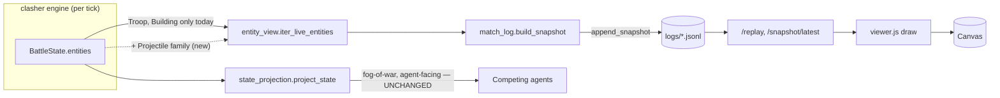

# Viewer upgrades: projectile effects, faster playback, early winner reveal

**Intent:** Make the match viewer show what's actually happening in a battle (not just melee blobs), let you scrub through it faster, and tell you who won without sitting through the whole thing.

## Overview

The simulation already computes everything needed for all three asks — nothing here requires touching the battle engine's game logic. Projectiles (arrows, fireballs, barrel rolls, bombs) are already simulated as real entities every tick; they're just filtered out before they reach the spectator log, so the viewer has never been able to draw them. The "8x" playback cap is a plain client-side `setInterval` value with no connection to how fast the engine actually computes a match (that already runs at full CPU speed, unthrottled). And in replay mode, the viewer already downloads the *entire* match — including its final, game-over frame — before you press Play; the winner is sitting in the browser's memory the whole time, just not shown until you scrub to the last tick.

So this is three small, independent slices through the same pipeline: engine → spectator snapshot → log file → web API → `viewer.js`. Two of the three (projectiles, early winner) only touch the spectator path — the agent-facing state (`state_projection.py`, what competing agents actually see and decide on) is deliberately left untouched, since none of this is about changing what agents know, only what a human watching can see.

## Architecture

## Design

### 1. Stop hiding projectiles from the spectator snapshot

`orchestrator/entity_view.py`'s `iter_live_entities` only yields `Troop`/`Building` instances. Widen it to also yield the projectile-family entities the engine already simulates: `Projectile`, `SpawnProjectile`, `RollingProjectile`, `TimedExplosive` (arrows, fireballs, Goblin Barrel, Log, Rolling Barrel, bombs). Explicitly out of scope: `AreaEffect` and `Graveyard` — those are persistent zones/spawners, a different visual category, not projectiles.

Each yielded projectile needs a `kind` field (`"unit"` vs `"projectile"`) added in `match_log.build_snapshot` so the viewer can tell them apart, plus its target x/y so the client can draw a direction without needing cross-frame state. Card name comes from the existing `source_name` field on these entities (e.g. `"Musketeer"`, `"Arrows"`) rather than `card_stats.name`, since projectiles don't carry full card stats.

Projectiles are already first-class entries in `BattleState.entities` — they don't need a new data path, just to stop being filtered out. Keeping them in the same `entities` list (tagged by `kind`) instead of a separate `effects` array keeps the log schema and the viewer's render loop simple: one list, one loop, branch on a field.

### 2. Render projectiles distinctly in the viewer

In `viewer.js`'s `draw()`, branch on `entity.kind === "projectile"`: draw a small team-colored streak (dot + short fading line oriented toward the target position) instead of the full unit treatment — no HP bar, no name label, no card icon. Direction is computed from the target x/y added in Step 1, not from comparing the current frame to the previous one, so it renders correctly regardless of how the replay is navigated (play, scrub, or jump-to-end all produce the same correct frame, because each frame is self-contained).

### 3. Playback speeds beyond 8x

`viewer.html`'s speed `<select>` today maps 1x/2x/4x/8x to `setInterval` delays of 200/100/50/25ms — at 8x it's already close to the browser's reliable timer floor (~10ms; shrinking further gets throttled inconsistently across browsers). Add **16x** and **32x** by keeping the interval floored around 25ms and advancing multiple ticks per timer fire instead of shrinking the interval further (16x = 2 ticks/25ms, 32x = 4 ticks/25ms). This scales cleanly past the timer floor and keeps redraw work (canvas clear + draw) at a steady rate.

### 4. See the winner without watching the replay

Once `/replay` finishes loading, immediately read the last snapshot's `winner`/`game_over` fields and show a persistent result badge, independent of the scrubber position — no need to press Play or drag to the end first. Also add a "Skip to End" button next to Play/Pause that jumps the scrubber straight to the final tick, for anyone who wants to see the final board state itself. Both are replay-mode-only — live mode has no "final" frame to peek at yet. This is a pure display change: the full match is already fetched into memory before playback starts, so it's just reading `snapshots[snapshots.length - 1]` once on load, no new network calls or backend changes.

### 5. Tests

- `tests/test_match_log.py`: extend `build_snapshot` coverage to assert a fired projectile shows up with `kind: "projectile"` and doesn't break the existing `max_hp > 0` / card-name assertions.
- Spot-check `state_projection.py`'s existing tests are untouched and still pass (confirms the agent-facing path wasn't disturbed).
- No new backend endpoints, so no new `test_web_server.py` cases are required — existing `/replay` coverage already exercises the changed payload shape.

### 6. Verify live in the browser

Run a real match with ranged attackers (e.g. Musketeer/Wizard/Giant vs a spell), open it in `/viewer`, and confirm: projectiles visibly fly and hit, the new speed options play smoothly, and the winner badge/skip-to-end both work — per this project's `verifying-intent` convention of exercising the real flow, not just unit tests.

## Definition of Done

- A replay with ranged attacks visibly shows projectiles traveling from attacker to target, distinct from units (no HP bar/label).
- The speed selector offers options beyond 8x that visibly play faster and don't glitch or freeze.
- Opening a finished match's replay shows who won immediately, without needing to press Play or manually scrub to the end.
- `state_projection.py` (what agents see) is untouched; only the spectator log/viewer path changed.
- Existing tests pass; new coverage exists for the widened snapshot.
- Implemented via the project's established Codex-dispatch pattern, reviewed, and committed.
